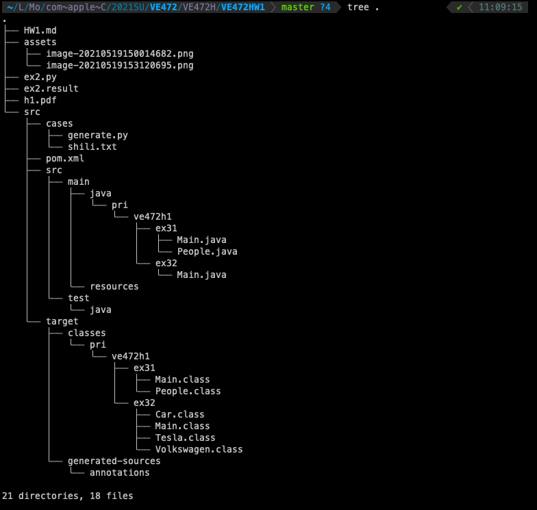

# VE472 H1

吴佳遥 517370910257

## EX1

### EX1.1

Cgroups, control groups, are a Linux kernel feature which allow processes to be organized into hierarchical groups whose usage of various types of resources can then be limited and monitored.

### EX1.2

A cgroup is a collection of processes that are bound to a set of limits or parameters defined via the cgroup filesystem.

Similariry is that a cgroup is a collection of processes.

Difference is that cgroup will be set limits or parameters.

### EX1.3

A namespace wraps a global system resource in an abstraction that makes it appear to the processes within the namespace that they have their own isolated instance of the global resource.  Changes to the global resource are visible to member processes of the namespace. 

However, such changes are invisible to other processes. If attacks happen in one namespcae, it would not affect the whole system. It could increase security.

## EX2

### EX2.1

1. Intel(R) Core(TM) i5-8259U CPU @ 2.30GHz. 
2. 8GB
3. CPU: `top`. RAM:`top`. Since I am working with macOS.

### EX2.2

Check `ex2.py` since it is the data processing script

1. It is DL, with 8064705 times of arrival delays in all.
2. Checking arrival delays, the three most, with their times of delay, are
   - DFW 72276
   - ATL 58137
   - ORD 57754
3. Counting on arrival delay. See below in json format

~~~json
{
    "US": 1646,
    "WN": 883,
    "NW": 2601,
    "PA (1)": 1070,
    "TW": 1086,
    "UA": 1437,
    "DL": 1439,
    "HP": 1309,
    "ML (1)": 472,
    "AA": 1521,
    "AS": 1140,
    "CO": 1187,
    "OH": 1242,
    "OO": 996,
    "XE": 927,
    "TZ": 1173,
    "EV": 1200,
    "FL": 1345,
    "HA": 1317,
    "MQ": 1710,
    "B6": 1048,
    "DH": 1050,
    "PI": 1418,
    "PS": 569,
    "EA": 1380,
    "F9": 899,
    "YV": 715,
    "9E": 1956,
    "AQ": 1021
}
~~~

### EX2.3

$DepDelay = DayOfWeek\times0.3+WeatherDelay\times0.7+CarrierDelay\times0.6+CRSDepTime\times0.1$

## EX3

### EX3.1

Check `src/main/java/pri/ve472h1/ex31`

Test case is in `src/cases/shili.txt`

Run the `main` function in `src/main/java/pri/ve472h1/ex31/Main.java`. There is no need for other input or arguments. It will just read the `shili.txt` metioned above

### EX3.2

Run the `main` function in `src/main/java/pri/ve472h1/ex32/Main.java`.

