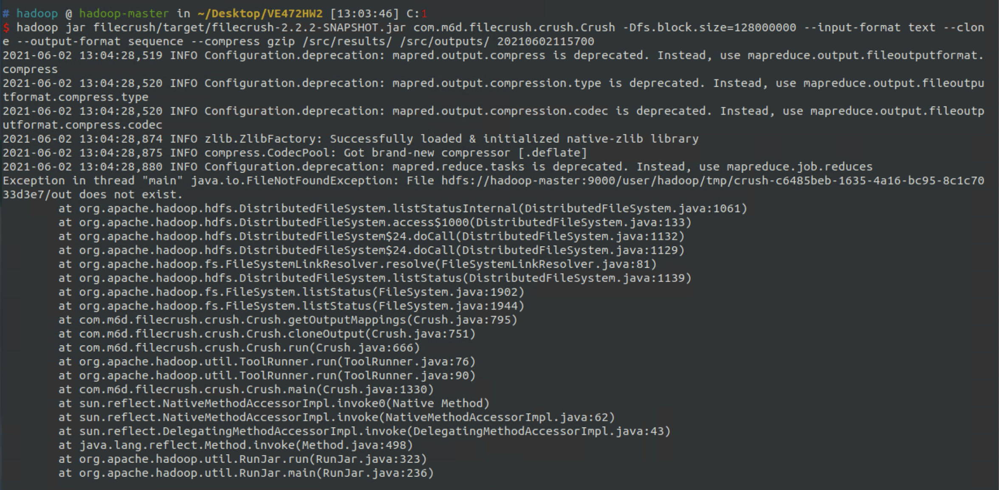

# VE472HW2

## 吴佳遥 517370910257

## 1. Preparation

### 1.1

See `src/ex4/input/csv.py`

try with

~~~
python3 csv.py [pagination] [students number] [number of generated grades]
~~~

Will generate a foler named `results` in the same directory as `csv.py` which contains all the results.

### 1.2

Use command

~~~
hdfs getconf -confKey dfs.blocksize
~~~

The block size is 134217728 bytes, namely 128MB.

## 2. Filecrush

### 2.1 

Crush consumes directories containing many small files with the same key and value types and creates fewer, larger files containing the same data.

We could use Filecrush to crush such small datasets together into an overall big dataset. And then use the big dataset as the input.

### 2.2

~~~
hadoop jar filecrush/target/filecrush-2.2.2-SNAPSHOT.jar com.m6d.filecrush.crush.Crush -Dfs.block.size=128000000 --input-format text --clone --output-format sequence --compress gzip /src/results src/outputs/ 20210602115700
~~~

## 3. S3DistCp

### 3.1

--groupBy=PATTERN: 

In case we have several small data files which share a same naming pattern, we could use --groupBY to concatenate all of our data files with this special naming pattern. Thus we can efficiently copy large amounts of data (first stored seperately in several small files) from Amazon S3 into HDFS and then compress all of them into a larger data file.

### 3.2 

Skipped

## 4. Avro

### 4.1

b) Snappy codec is the implementation of Snappy compression and decompression.

### 4.2 

See `src/ex4/ex4.json`

Output in `src/ex4/src/main/java/ex4/avro/AvroFile.java`

#### 4.3

See `src/ex4/src/main/java/CompactSmallFiles.java`

### 4.4

See `src/ex4/src/main/java/ExtractSmallFiles.java`

### Overall Test:

The whole process is already written in `src/ex4/src/main/java/Main.java`. 

Run it. Output is in `src/ex4/output/newResults`

Run the script at `src/ex4/test.sh` to diff all the files between original csv files in `src/ex4/input/results` and processed new csv files in `src/ex4/output/newResults`

### Note

All the generated files in Section 1 and Section is deleted. 

You could go to `src` and exec `happyAll.sh` for the overall process

