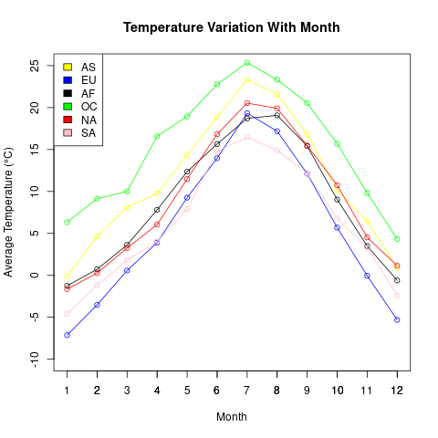
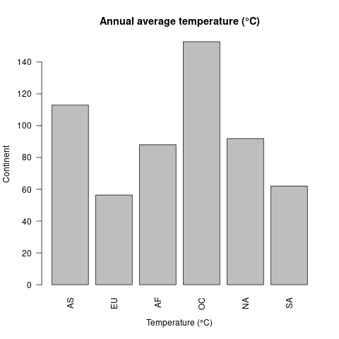

# VE472 HW4

吴佳遥 517370910257

## Setup

~~~sql
CREATE TABLE dfs.tmp.`station` AS SELECT * FROM (
select
TRIM(SUBSTR(columns[0], 1, 11)) as id,
TRIM(SUBSTR(columns[0],13,8)) as latitude,
TRIM(SUBSTR(columns[0],22,9)) as longitude,
TRIM(SUBSTR(columns[0],32,6)) as altitude,
TRIM(SUBSTR(columns[0], 39, 2)) as state,
TRIM(SUBSTR(columns[0], 42, 30)) as name
from dfs.root.`/home/hadoop/ve472/weather/meta.csv`
);
~~~

~~~sql
CREATE TABLE dfs.tmp.`weather` AS SELECT * FROM (
select
columns[0] as id,
columns[1] as ob_date,
columns[2] as ob_type,
columns[3] as ob_value
from dfs.root.`/home/hadoop/ve472/weather/2017.csv`
);
~~~

~~~sql
CREATE TABLE dfs.tmp.`country` AS SELECT * FROM (
select
columns[0] as name,
columns[1] as continent,
columns[2] as fips
from dfs.root.`/home/hadoop/ve472/weather/country_continent.csv`
);
~~~

~~~sql
use dfs.tmp;
~~~

## EX1.

### 1. Join operation

A `JOIN` clause is used to combine rows from two or more tables, based on a related column between them.

- `INNER JOIN`: selects records that have matching values in both tables.
- The `FULL OUTER JOIN` keyword returns all records when there is a match in left (table1) or right (table2) table records.
- The `LEFT JOIN` keyword returns all records from the left table (table1), and the matching records from the right table (table2). The result is 0 records from the right side, if there is no match.
- The `RIGHT JOIN` keyword returns all records from the right table (table2), and the matching records from the left table (table1). The result is 0 records from the left side, if there is no match.

### 2. Aggregate

An aggregate function is a function where the values of multiple rows are grouped together to form a single summary value.

The `COUNT()` function returns the number of rows that matches a specified criterion.

The `AVG()` function returns the average value of a numeric column. 

The `SUM()` function returns the total sum of a numeric column. 

The `MIN()` function returns the smallest value of the selected column.

The `MAX()` function returns the largest value of the selected column.

### 3. Advanced Nested Queries

1. The top five stations with the lowest average daily temperature

   ~~~sql
   select station.name,weather.ob_value from weather
   inner join station using (id)
   where weather.ob_type = 'TAVG'
   and LENGTH(weather.ob_value) > 0
   and LENGTH(station.state) > 0
   order by CAST(weather.ob_value as INTEGER) limit 5;
   ~~~

   ~~~
   +------------------+----------+
   |       name       | ob_value |
   +------------------+----------+
   | Port Graham      | -999     |
   | Monahan Flat     | -999     |
   | Rocky Point      | -999     |
   | RAM CREEK ALASKA | -733     |
   | RAM CREEK ALASKA | -733     |
   +------------------+----------+
   ~~~

2. The top three stations with the highest max daily temperaturein 20170831
  ~~~sql
   select station.id,station.name,weather.ob_value from weather
   inner join station using (id)
   where weather.ob_type = 'TMAX' 
   and weather.ob_date = '20170831'
   and length(weather.ob_value) > 0
   and length(station.name) > 0
   order by cast(weather.ob_value as float) desc limit 3;
  ~~~

~~~
+-------------+------------+----------+
|     id      |    name    | ob_value |
+-------------+------------+----------+
| KUM00040586 | JAHRA      | 484      |
| IZ000040665 | KUT-AL-HAI | 484      |
| IRM00040811 | AHWAZ      | 481      |
+-------------+------------+----------+
~~~
3. Min temperatures of stations with longitude between 29.5E and 30E
~~~sql
select station.id,min(cast(weather.ob_value as float)) as tmin from weather
inner join station using (id)
where length(weather.ob_value) > 0
and length(station.name) > 0 
and length(station.longitude) > 0
and cast(station.longitude as float) < 30 
and cast(station.longitude as float) > 29.5 
group by station.id;
~~~

~~~
+-------------+--------+
|     id      |  tmin  |
+-------------+--------+
| ROM00015360 | -155.0 |
| TUM00017155 | -143.0 |
| SF001290070 | -107.0 |
| FIE00146117 | 0.0    |
| FIE00146598 | -260.0 |
| FIE00144951 | -242.0 |
| FIE00144887 | 0.0    |
| FIE00144957 | -258.0 |
| RSM00026268 | -277.0 |
| FIE00144172 | 0.0    |
| FIE00144877 | -288.0 |
| NOE00133230 | 0.0    |
| NOE00133210 | -180.0 |
| FIE00144917 | 0.0    |
| RSM00026167 | -260.0 |
| BOM00033038 | -250.0 |
| EGM00062318 | 0.0    |
+-------------+--------+
~~~

## EX2

1. ### Perfect Weather

- Precipitation: $\leq 20mm$ 
- Average Temperature:  $15-25℃$
- Daily Temperature Amplitude: $\leq 7℃$

### 2. Determine

First count days with perfect weather. See which stations have the most 10.

~~~sql
select tmax.id, COUNT(*) as perfect_days from weather tmax
inner join weather tmin on tmax.id = tmin.id and tmax.ob_date = tmin.ob_date and tmin.ob_type = 'TMIN'
inner join weather tavg on tmax.id = tavg.id and tmax.ob_date = tavg.ob_date and tavg.ob_type = 'TAVG'
inner join weather prcp on tmax.id = prcp.id and tmax.ob_date = prcp.ob_date and prcp.ob_type = 'PRCP'
where tmax.ob_type = 'TMAX'
and cast(prcp.ob_value as float) <= 150
and cast(tmax.ob_value as float) - cast(tmin.ob_value as float) <= 70
and cast(tavg.ob_value as integer) between 150 and 250
group by tmax.id
order by perfect_days desc
limit 10;
~~~

~~~
+-------------+--------------+
|     id      | perfect_days |
+-------------+--------------+
| SPE00120431 | 344          |
| SPE00120449 | 329          |
| SPE00120458 | 250          |
| SPE00120197 | 245          |
| ASN00009518 | 203          |
| ASN00009193 | 200          |
| SPE00120017 | 198          |
| USW00023188 | 187          |
| SP000060338 | 153          |
| MP000061995 | 140          |
+-------------+--------------+
~~~

Get the country

~~~sql
select * from country
where fips in (
    select station.state from station
    where station.id in (
        select id from (
            select tmax.id, COUNT(*) as perfect_days from weather tmax
            inner join weather tmin on tmax.id = tmin.id and tmax.ob_date = tmin.ob_date and tmin.ob_type = 'TMIN'
            inner join weather tavg on tmax.id = tavg.id and tmax.ob_date = tavg.ob_date and tavg.ob_type = 'TAVG'
            inner join weather prcp on tmax.id = prcp.id and tmax.ob_date = prcp.ob_date and prcp.ob_type = 'PRCP'
            where tmax.ob_type = 'TMAX'
            and cast(prcp.ob_value as float) <= 150
            and cast(tmax.ob_value as float) - cast(tmin.ob_value as float) <= 70
            and cast(tavg.ob_value as integer) between 150 and 250
            group by tmax.id
            order by perfect_days desc
       )
      where perfect_days > 50
    )
)
and length(continent) > 0;
~~~

~~~
+--------------+-----------+------+
|     name     | continent | fips |
+--------------+-----------+------+
| Suriname     | SA        | NS   |
| Turkmenistan | AS        | TX   |
| Botswana     | AF        | BC   |
| Canada       | NA        | CA   |
+--------------+-----------+------+
~~~

My travel destination will be Suriname.

## EX3

### 3.1

~~~sql
select ob_month,avg(cast(ob_value as integer)) as avg_temperature
from (
    select *, substr(ob_date,5,2) as ob_month from weather
)
where id in (
select st.id from station st
	inner join country ctry on st.state = ctry.fips
	where ctry.continent = 'AS'
)
and ob_type = 'TAVG'
group by ob_month
order by cast(ob_month as integer);
~~~
R script in `src/ex3.1.R`

###  3.2

~~~sql
select avg(cast(ob_value as integer)) as avg_temperature from weather
semicolon> where id in (
	select st.id from station st
	inner join country ctry on st.state = ctry.fips
	where ctry.continent = 'SA'
)
and ob_type = 'TAVG';
~~~

R script in `src/ex3.2.R`

