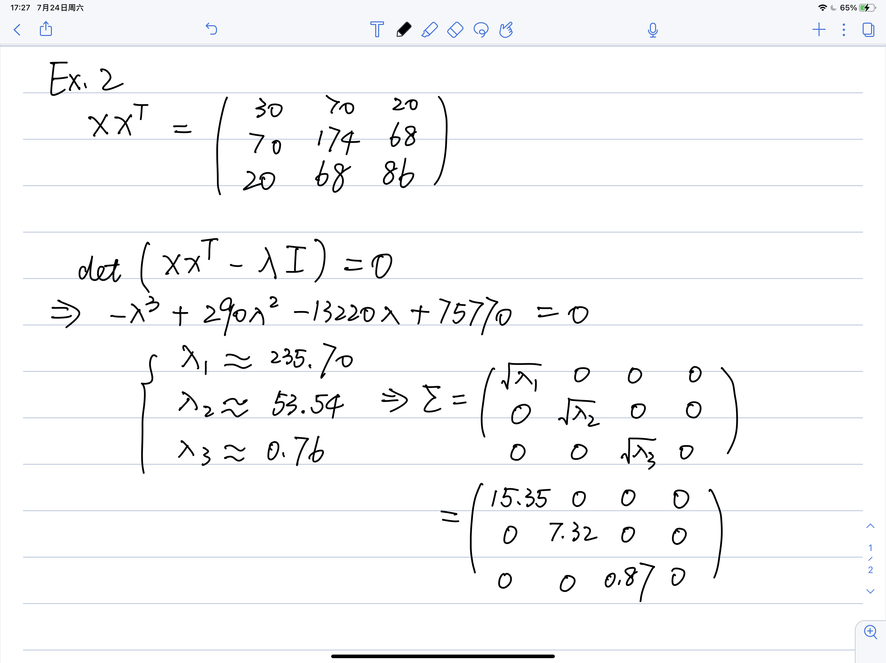

# VE472 HW5

吴佳遥 517370910257

## EX 1

### 1. 

If we do not increase the precision, there will be an error with a single data. Whatever small error it may be, when the data becomes huge, the error will increase with the data amount and finally becomes a huge error to the result.

### 2.

~~~matlab
clear; clearvars;
matrices = cell(1, 100);
for i = 1 : 100
    matrices{i} = rand(1000,100);
end
disp('a)')
tic;
for i = 1 : 100
    X = matrices{i};
    [U,S,V] = svd(X);
end
toc;
disp('b)')
tic;
for i = 1 : 100
    X = matrices{i};
    [U,S,V] = svd(X');
end
toc;
disp('c)')
tic;
for i = 1 : 100
    X = matrices{i};
    e = eig(X*(X'));
end
toc;
disp('d)')
tic;
for i = 1 : 100
    X = matrices{i};
    e = eig((X')*X);
end
toc;
~~~

### 3.

#### a)

~~~matlab
X = [-9 11 -21 63 -252; 70 -69 141 -421 1684; -575 575 -1149 3451 -13801; 3891 -3891 7782 -23345 93365; 1024 -1024 2048 -6144 24572];
baseEig = eig(X);
variations = zeros(5, 1);
for i = 1 : 1000
	perturbations = eps(X) .* rand(5,5);
	e = eig(X + perturbations);
	variations = variations + (e - baseEig);
end
disp(variations);
~~~

#### b)

~~~
X = [-9 11 -21 63 -252; 70 -69 141 -421 1684; -575 575 -1149 3451 -13801; 3891 -3891 7782 -23345 93365; 1024 -1024 2048 -6144 24572];
baseSVD = svd(X);
variations = zeros(5, 1);
for i = 1 : 1000
	perturbations = eps(X) .* rand(5,5);
	svdValue = svd(X + perturbations);
	variations = variations + (svdValue - baseSVD);
end
disp(variations);
~~~


## EX2



## EX3

### 1.

PCA decreases the dimension of the data so that Krystor can see the relation bewteen two sensors more directly ( i mean with less data processing)

### 2.

```python
import numpy as np
from sklearn.decomposition import PCA

if __name__ == '__main__':
    sensor_mat = np.mat(np.loadtxt(open("cinema_sensors/sensors1.csv", "rb"), delimiter=','))[:, :1000]
    pca = PCA()
    pca.fit(sensor_mat)

    target = 0.9 * sum(pca.explained_variance_ratio_)
    for N in range(1, 1001):
        pca = PCA(n_components=N)
        pca.fit(sensor_mat)
        ret = sum(pca.explained_variance_ratio_)
        if ret > target:
            print(N)
            break
```

N=3

### 3.

~~~
import numpy as np
from sklearn.decomposition import PCA
from sklearn.linear_model import LinearRegression

if __name__ == '__main__':
    sensor_mat = np.mat(np.loadtxt(open("cinema_sensors/sensors1.csv", "rb"), delimiter=','))[:, :1000]
    y = sensor_mat[:, -1]
    pca = PCA(n_components=3)
    x = pca.fit_transform(sensor_mat[:, :1000])
    print("data shape:", x.shape, y.shape)
    reg = LinearRegression().fit(x, y)
    print("Rˆ2:", reg.score(x, y))
    print("coefficient:", reg.coef_.flatten())
    print("intercept:", reg.intercept_.flatten())
~~~

~~~
data shape: (10000, 3) (10000, 1)
Rˆ2: 0.996039896320849
coefficient: [ 0.62564059  0.28116334 -0.36152544]
intercept: [761.0112442]
~~~

### 4.

For `sensor2.csv`

N=3

~~~
data shape: (100, 3) (100, 1)
Rˆ2: 0.9950861037323646
coefficient: [ 0.59925067 -0.27709259 -0.38590096]
intercept: [731.15229]
~~~

I think sensor 2 contains the output of the sensors in the electric circuit of Reapor Rich’s new cinema

