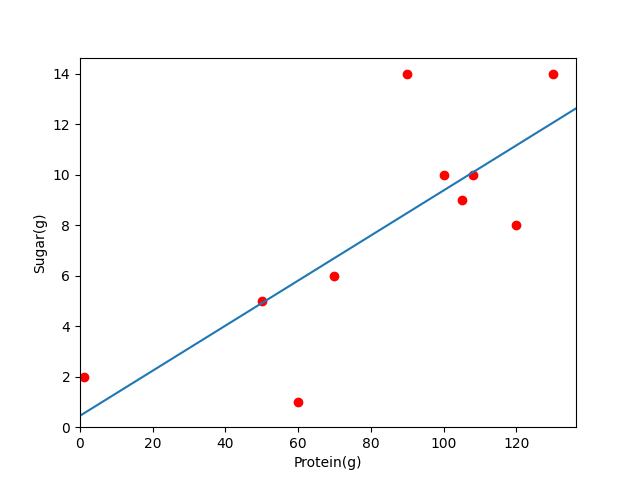

# VE472 HW6

wujiayao 517370910257

## ex1.

### 1. 

~~~python
import matplotlib.pyplot as plt
import numpy as np

if __name__ == '__main__':
    x = [70, 120, 50, 60, 1, 100, 90, 130, 105, 108]
    y = [6, 8, 5, 1, 2, 10, 14, 14, 9, 10]
    slope, intercept = np.polyfit(x, y, 1)
    print('y={}m + {}'.format(slope, intercept))

    xn = np.linspace(0, 200)
    yn = np.polyval([slope, intercept], xn)

    plt.plot(x, y, 'or')
    plt.xlim(0)
    plt.ylim(0)
    plt.plot(xn, yn)
    plt.xlabel("Protein(g)")
    plt.ylabel("Sugar(g)")
    plt.savefig('../hw6.assets/ex1_1.png')

~~~

`y=0.08928360326279702m + 0.45374748788272773`

> A mathematical procedure for finding the best-fitting curve to a given set of points by minimizing the sum of the squares of the offsets ("the residuals") of the points from the curve. The sum of the *squares* of the offsets is used instead of the offset absolute values because this allows the residuals to be treated as a continuous differentiable quantity. However, because squares of the offsets are used, outlying points can have a disproportionate effect on the fit, a property which may or may not be desirable depending on the problem at hand.

Source: https://mathworld.wolfram.com/LeastSquaresFitting.html

### 2. 

~~~python
import matplotlib.pyplot as plt
import numpy as np
import random

if __name__ == '__main__':
    x = np.array([70, 120, 50, 60, 1, 100, 90, 130, 105, 108])
    y = np.array([6, 8, 5, 1, 2, 10, 14, 14, 9, 10])

    std_x = (x - x.mean()) / x.std()
    std_y = (y - y.mean()) / y.std()
    print('x:', std_x)
    print('y:', std_y)

    sse_count = 0
    for i in range(10):
        a = random.random()
        b = random.random()
        y_p = a + b * std_x
        sse = np.square(y_p - std_y).sum()
        print('Trial {} SSE: {}'.format(i, sse))
        sse_count += sse
    print('Avg: {}'.format(sse_count / 10))
~~~

#### a)

~~~
x: [-0.36423804  0.99485911 -0.90787689 -0.63605746 -2.2397921   0.45122025
  0.17940082  1.26667854  0.58712997  0.6686758 ]
y: [-0.44920898  0.02364258 -0.68563476 -1.63133788 -1.3949121   0.49649414
  1.44219726  1.44219726  0.26006836  0.49649414]
~~~

#### b)

~~~
Trial 0 SSE: 5.091630291530809
Trial 1 SSE: 16.174344735396847
Trial 2 SSE: 12.825712751075661
Trial 3 SSE: 6.805783960879488
Trial 4 SSE: 10.405780524028705
Trial 5 SSE: 13.205064380142298
Trial 6 SSE: 9.389782622749683
Trial 7 SSE: 8.236842358935364
Trial 8 SSE: 6.705272414637759
Trial 9 SSE: 9.662513025561804
Avg: 9.850272706493843
~~~

### 3.

#### a)

$$
\frac{\partial SSE}{\partial a}= - \sum_{i=1}^{10}-2(y_i-a-b_{x_i}) \\
\frac{\partial SSE}{\partial b}= - \sum_{i=1}^{10}-2x_i(y_i-a-b_{x_i}) 
$$

#### b)

### 4.

## ex2

### 1. 

#### a)

Work: $\mathcal{O}(mn)$

depth: $\mathcal{O}(\log m+\log n)$

#### b)

Work: $\mathcal{O}(\log \frac{1}{\epsilon})\mathcal{O}(m)\mathcal{O}(\log n)$

depth: $\mathcal{O}(\log m)+\mathcal{O}(\log n)$

#### c)

It is poor at parallelization.

The complexity will not work well on big data when m becomes large
